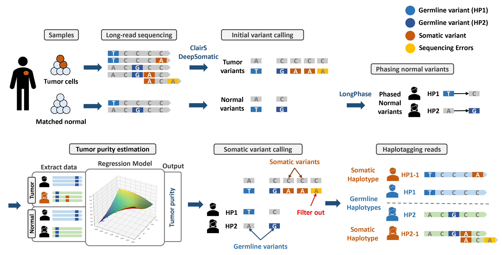
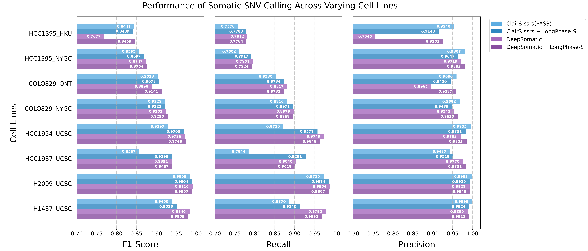
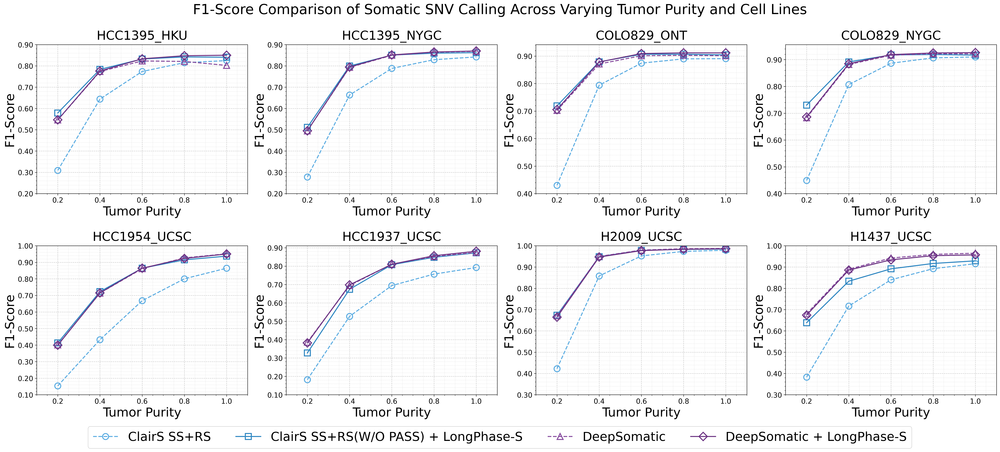
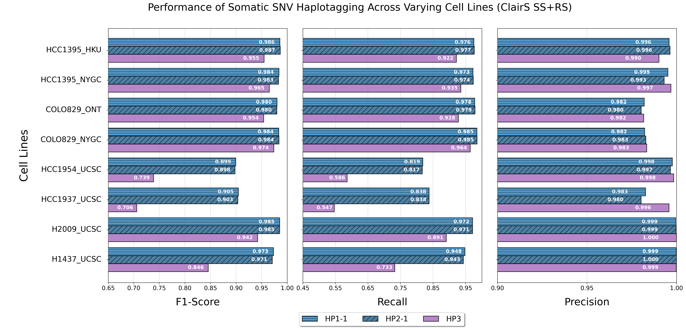
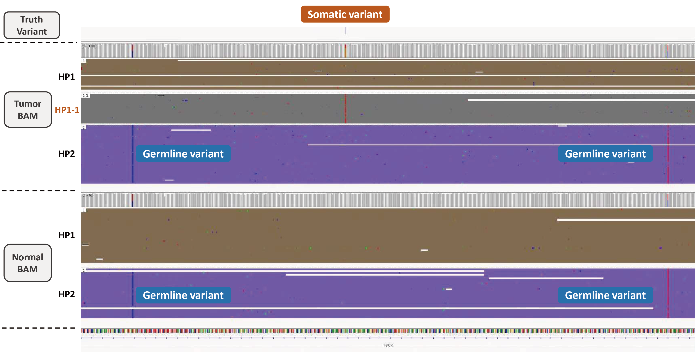

# LongPhase-S
LongPhase-S is a program for somatic haplotagging and tumor purity estimation from tumor-normal pair long-read sequencing data. It also supports germline variant phasing and haplotagging, and is based on [**LongPhase**](https://github.com/twolinin/longphase) (v2.0.0).

Key Features:
- Enhances somatic variant calling accuracy
- Somatic haplotagging
- Tumor purity estimation

## Somatic Haplotagging Workflow


## Performance Evaluation

We evaluated the performance of LongPhase-S across six cancer cell lines using ONT tumor–normal paired long-read sequencing data. Germline variants were called using "Clair3 v1.0.10", and benchmarking was conducted against different truth variant sources:
- **HCC1395** : Truth variants from SEQC2
- **COLO829** : Truth variants from New York Genome Center
- **Four additional cell lines** : Truth variants from DeepSomatic orthogonal tools benchmark


### Somatic Variant Calling Performance (ONT)
#### **SNV performance**
This figure compares the performance of somatic SNV calling between "ClairS v0.4.1 with SS+RS model" and "DeepSomatic v1.8.0", before and after applying LongPhase-S.



#### **SNV performance across varying tumor purity**
This figure shows the F1-score of somatic SNV calling across different tumor purity levels and cell lines, using the same somatic variant callers and LongPhase-S integration as described above. Different tumor purity levels were simulated by mixing tumor and normal BAM files at specified ratios, with tumor coverage fixed at 50x and normal coverage fixed at 25x.  

  

### Somatic Haplotagging Performance
This figure shows the performance of LongPhase-S in somatic SNV haplotagging, using tumor VCF files generated by "ClairS v0.4.1 with the SS+RS model". The evaluation is conducted across various cell lines, with metrics including F1-score, recall, and precision for different haplotype tagging categories.



### Tumor Purity Estimation
This figure compares tumor purity estimation results between "ASCAT v3.2.0" and "LongPhase-S v1.0.0" (using different somatic variant callers) across multiple cell lines. Different tumor purity levels were simulated by mixing tumor and normal BAM files at specified ratios, with tumor coverage fixed at 50x and normal coverage fixed at 25x.  


## IGV Visualization of Somatic Haplotagging Result
This figure shows an example of tagged tumor BAM file visualized in IGV, demonstrating somatic haplotagging results on HCC1395/HCC1395BL tumor/normal ONT data. 



## Contents
- [Installation](#installation)
- [Usage](#usage)
  - [**Somatic mode**](#somatic-mode)
	- [Somatic haplotagging command](#somatic-haplotagging-command)
		- [SNP-only somatic haplotagging](./docs/somatic_haplotag.md#snp-only-somatic-haplotagging)
		- [Somatic haplotagging benchmark](./docs/somatic_haplotag.md#somatic-haplotagging-benchmark)
		- [The complete list of somatic haplotagging parameters](./docs/somatic_haplotag.md#the-complete-list-of-somatic-haplotagging-parameters)
		- [Output files](#output-files)
			- [Tumor purity estimation file](./docs/somatic_haplotag.md#tumor-purity-estimation-result-file)
			- [Somatic calling result VCF file](./docs/somatic_haplotag.md#somatic-calling-result-vcf-file)
			- [Benchmark metrics file](./docs/somatic_haplotag.md#benchmark-metrics-file)
	- [Tumor purity estimation command](#tumor-purity-estimation-command)
		- [the complete list of purity estimation parameters](./docs/purity_estimation.md#the-complete-list-of-purity-estimation-parameters)
		- [Tumor purity estimation file](./docs/somatic_haplotag.md#tumor-purity-estimation-result-file)
  - [**Germline mode**](#germline-mode)
	- [Phasing command](#phasing-command)
		- [SNP-only phasing](./docs/phase.md#snp-only-phasing)
		- [The complete list of phasing parameters](./docs/phase.md#the-complete-list-of-phase-parameters)
		- [Output of SNP and indel phasing](./docs/phase.md#output-of-snp-and-indel-phasing)
	- [Haplotagging command](#haplotagging-command)
		- [The complete list of haplotagging parameters](./docs/haplotag.md#the-complete-list-of-haplotagging-parameters)

- [Input Preparation](#input-preparation)
	- [Generate reference index](./docs/input_preparation.md#generate-reference-index)
	- [Generate alignment and index files](./docs/input_preparation.md#generate-alignment-and-index-files)
	- [Generate germline SNP file](./docs/input_preparation.md#generate-germline-snp-vcf-file)
	- [Generate somatic SNP file](./docs/input_preparation.md#generate-somatic-snp-vcf-file)
	- [Preprocessing for somatic mode commands](#preprocessing-for-somatic-mode-commands)
- [Citation](#citation)
- [Contact](#contact)
---
## Installation
<!-- You are recommended to download a [linux 64bit binary release](https://github.com/twolinin/longphase/releases/download/v1.7.3/longphase_linux-x64.tar.xz) without compilation. 

```
wget https://github.com/twolinin/longphase/releases/download/v2.0/longphase_linux-x64.tar.xz
tar -xJf longphase_linux-x64.tar.xz
``` -->
<!-- An executable file, longphase_linux-x64, can be executed directly. If 
you need to compile a local version, you can clone and compile using 
the following commands, and make sure that the environment has zlib 
installed. If you require setting up a virtual environment, we also 
provide a [Dockerfile](https://github.com/ming-en-ho/longphase-
s/blob/somatic-develop/Dockerfile). -->

Clone and compile using the following commands, and make sure that the environment has zlib installed. If you require setting up a virtual environment, we also provide a [Dockerfile](https://github.com/ming-en-ho/longphase-s/blob/somatic-develop/Dockerfile).

```
git clone https://github.com/ming-en-ho/longphase-s.git
cd longphase-s
autoreconf -i
./configure
make -j 4
```

---
## Usage

### Somatic haplotagging command
#### SNP-only somatic haplotagging
This command performs tumor purity estimation and somatic variant calling using tumor-normal pair BAM files, then tags (assigns) each read in tumor BAM to one haplotype based on phased normal SNP VCF and tumor SNP VCF. The reads will be tagged as:
- `HP:z:1` or `HP:z:2` for reads with germline SNPs
- `HP:z:1-1` or `HP:z:2-1` for reads with somatic SNPs derived from germline haplotype 1 or 2
- `HP:z:3` for reads with somatic SNPs that cannot be derived from germline haplotypes

In addition, the haplotype block of each read is stored in the PS tag (only for reads with phased SNPs). The phased VCF can be generated by other programs as long as the PS or HP tags are encoded. The author can specify `--log` for additionally output a plain-text file containing haplotype tags of each read without parsing BAM.

```
longphase-s somatic_haplotag \
-s phased_normal_snp.vcf \
-b normal.bam \
--tumor-snp-file tumor_snp.vcf \
--tumor-bam-file tumor.bam \
-r reference.fasta \
-t 8 \
-o tagged_tumor_bam_prefix \
--tagSupplementary \
-q 20 \
```


- [The complete list of somatic haplotagging parameters](./docs/somatic_haplotag.md#the-complete-list-of-somatic-haplotagging-parameters)

**Note**: See [Input Preparation](#input-preparation) for preprocessing steps to prepare the required input files.

#### Output files:
- Tagged tumor BAM file
- [Tumor purity estimation file](./docs/somatic_haplotag.md#tumor-purity-estimation-result-file)
- [Somatic calling result VCF](./docs/somatic_haplotag.md#somatic-calling-result-vcf-file) (if `--output-somatic-vcf` is enabled)
- [Benchmark metrics file](./docs/somatic_haplotag.md#benchmark-metrics-file) (if truth files are provided)

#### Somatic haplotagging benchmark :
- If `--truth-vcf` is provided, it will evaluate the performance of somatic haplotagging by comparing the reads that truly contain somatic variants with the reads that are tagged as somatic reads. 
- If `--truth-bed` is also provided, the evaluation will only consider variants within these regions.
- [See detailed benchmark methodology](./docs/somatic_haplotag.md#somatic-haplotagging-benchmark)

### Tumor purity estimation command
This command using tumor-normal pair BAM and VCF files, along with haplotype information, and outputs the estimation file.

```
longphase-s estimate_purity \
-s phased_normal_snp.vcf \
-b normal.bam \
--tumor-snp-file tumor_snp.vcf \
--tumor-bam-file tumor.bam \
-r reference.fasta \
-t 8 \
-o output_prefix
```
- [The complete list of purity estimation parameters](./docs/purity_estimation.md#the-complete-list-of-purity-estimation-parameters)
- [Tumor purity estimation file](./docs/somatic_haplotag.md#tumor-purity-estimation-file)

**Note**: See [Input Preparation](#input-preparation) for preprocessing steps to prepare the required input files.

### Phasing command
#### SNP-only phasing
For SNP-only phasing, the input of LongPhase consists of SNPs in VCF (e.g., SNP.vcf), an indexed reference in Fasta (e.g., reference.fasta, reference.fasta.fai), and one (or multiple) indexed read-to-reference alignment in BAM (e.g., alignment1.bam, alignment1.bai, alignment2.bam, ...) (see [Input Preparation](#input-preparation)). The users should specify the sequencing platform (--ont for Nanopore and --pb for PacBio). An example of SNP phasing usage is shown below.
```
longphase-s phase \
-s SNP.vcf \
-b alignment1.bam \
-b alignment2.bam \
-r reference.fasta \
-t 8 \
-o phased_prefix \
--ont # or --pb for PacBio Hifi
```
- [The complete list of phase parameters](./docs/phase.md#the-complete-list-of-phase-parameters)
- [Output of SNP and indel phasing](./docs/phase.md#output-of-snp-and-indel-phasing)


### Haplotagging command
This command tags (assigns) each read (in BAM) to one haplotype in the phased SNP/SV VCF. i.e., reads will be tagged as HP:i:1 or HP:i:2. In addition, the haplotype block of each read is stored in the PS tag. The phased VCF can be also generated by other programs as long as the PS or HP tags are encoded. The author can specify ```--log``` for additionally output a plain-text file containing haplotype tags of each read without parsing BAM.
```
longphase-s haplotag \
-r reference.fasta \
-s phased_snp.vcf \
--sv-file phased_sv.vcf \
-b alignment.bam \
-t 8 \
-o tagged_bam_prefix
```
- [The complete list of haplotagging parameters](./docs/haplotag.md#the-complete-list-of-haplotagging-parameters)

---
## Input Preparation

- [Generate reference index](./docs/input_preparation.md#generate-reference-index)
- [Generate alignment and index files](./docs/input_preparation.md#generate-alignment-and-index-files)
- [Generate germline SNP file](./docs/input_preparation.md#generate-germline-snp-vcf-file)
- [Generate somatic SNP file](./docs/input_preparation.md#generate-somatic-snp-vcf-file)

### Preprocessing for somatic mode commands
For somatic haplotagging and tumor purity estimation commands, the preprocessing workflow is:
1. Generate tumor SNP VCF using [somatic variant callers](./docs/input_preparation.md#generate-somatic-snp-vcf-file)
2. Generate normal SNP VCF using [germline variant callers](./docs/input_preparation.md#generate-germline-snp-vcf-file)
3. Perform phasing on normal SNP VCF using normal BAM to obtain phased normal SNP VCF (e.g., using [phasing command](./docs/phase.md#phase-command))


---
## Citation
Jyun-Hong Lin, Liang-Chi Chen, Shu-Qi Yu and Yao-Ting Huang, [LongPhase: an ultra-fast chromosome-scale phasing algorithm for small and large variants](https://academic.oup.com/bioinformatics/advance-article-abstract/doi/10.1093/bioinformatics/btac058/6519151), Bioinformatics, 2022.

---
## Contact
Yao-Ting Huang, ythuang at cs.ccu.edu.tw
